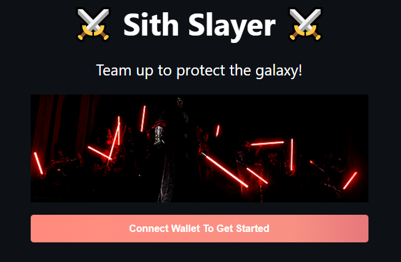
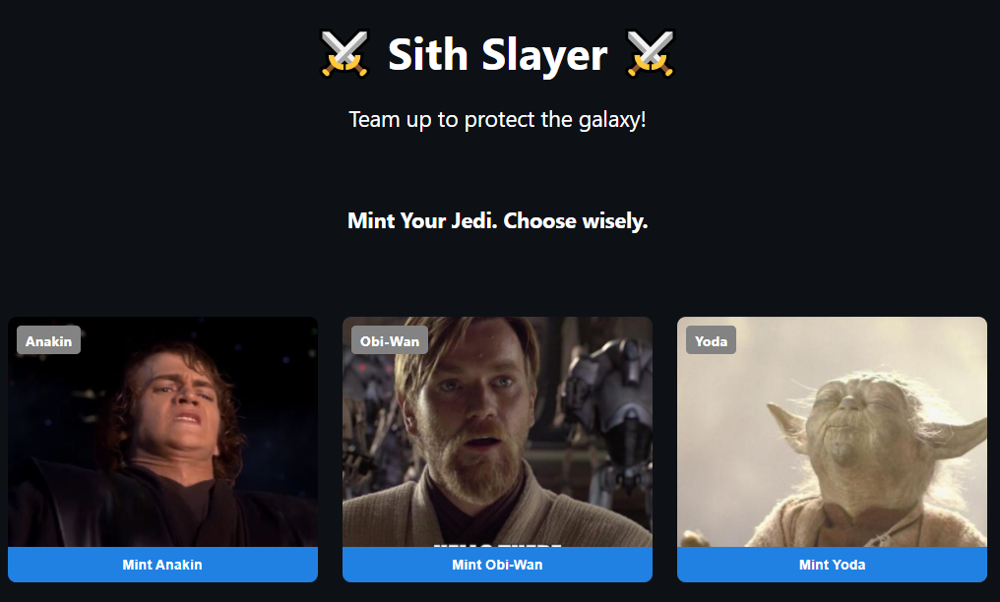
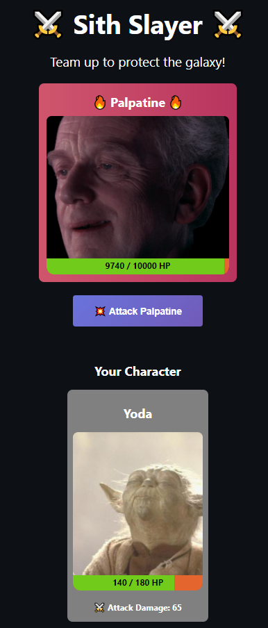
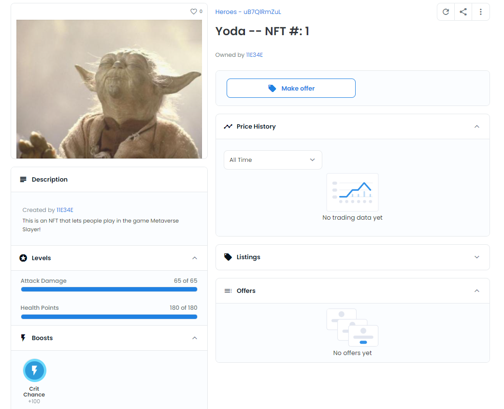

# Sith Slayer Game

This project explores how to use NFTs in gaming. The NFTs generated from this project are Star Wars characters with their own attributes such as health, attack, and critical chance. Each user can have one character NFT. All users face off against the same sith enemy. Multiple users have to work together to bring down the enemy before their own health drops to 0.

## Explored concepts
- NFT imageURIs are stored via [IPFS](https://hackernoon.com/a-beginners-guide-to-ipfs-20673fedd3f).
- [Chainlink VRF](https://docs.chain.link/docs/chainlink-vrf/) is used to generate randomness when calculating critical hits

[Link to live demo](https://nft-game-starter-project.wleung85.repl.co)

[Link to players' character NFTs](https://testnets.opensea.io/collection/heroes-ub7qlrmzul)

To test contract with run script:
`npx hardhat run scripts/run.js`

To deploy contract on Rinkeby:
`npx hardhat run --network rinkeby scripts/deploy.js`

Project created with buildspace.

## What the app looks like with the frontend:
**Before connecting MetaMask wallet**  

**After connecting MetaMask wallet**  

**After minting a character NFT and in the arena**  

**Minted character NFT seen on OpenSea**  

